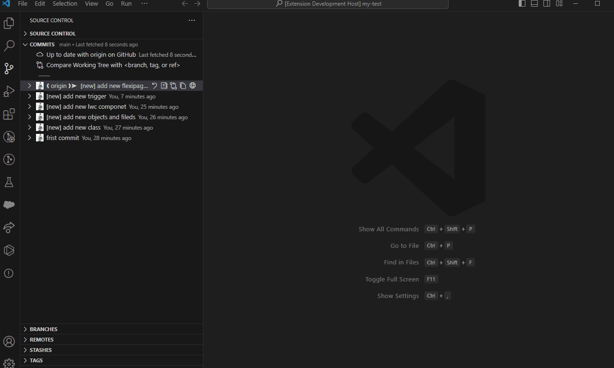

# SFDC Package.xml Generator By Git History

## README

This is a tool that can convert the diff files between two Git commits into a Salesforce metadata API Package.xml. 

### Conditions of use

1.Ensure that git is installed.
2.Ensure that a git repository exists.
3.Ensure the file belongs to Salesforce Metadata files.

### Usage

### Disclaimer:
If there are any issues during use, you can contact the author. However, I do not assume any responsibility for problems arising in commercial use.

Author: Haruki
GitHub: mao377542770